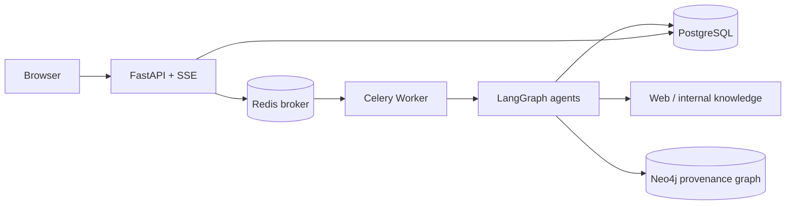

# Evidence-first Deep Research Platform - 프로젝트 보고서

## 1. 문제 정의

일반적인 LLM 리서치는 긴 실행 시간, 불투명한 중간 과정, 출처 없는 결론이라는 문제가 있다. 이 프로젝트는 주제 입력부터 근거 수집, 비평, 결과 검증까지의 과정을 관찰 가능하고 재현 가능한 비동기 워크플로우로 구현한다.

## 2. 구현 범위

| 영역 | 구현 |
|---|---|
| 멀티 에이전트 | LangGraph 기반 Planner, Search, Compression, Writer, Critic 및 수정 루프 |
| 장시간 작업 | FastAPI 요청 즉시 반환 + Redis/Celery 비동기 worker |
| 영속성 | PostgreSQL에 작업, 이벤트 타임라인, 수집 출처, 보고서, 품질 지표 저장 |
| 신뢰성 | 출처 번호 보존 압축, 인용 유효성/범위 점수, Critic 수정 루프 |
| 제품 UI | 웹 대시보드, SSE 실시간 타임라인, 출처 카드, Markdown/PDF 내보내기 |
| 운영성 | Docker Compose, healthcheck, 요청 ID 구조화 로그, 선택적 API key 보호 |
| GraphDB | Neo4j에 `Research → Source → Entity` 근거 그래프와 엔터티 관계 저장 |

## 3. 아키텍처

Redis는 빠른 메시지 전달을 위한 Celery broker이고, PostgreSQL은 보고서와 실행 이력의 기준 저장소다. 따라서 worker 재시작 후에도 산출물과 근거를 조회할 수 있다.

Neo4j는 관계 탐색 전용 저장소다. 리서치에서 수집한 출처가 어떤 엔터티를 언급하는지와 엔터티 간 관계를 저장한다. 이후 "A 기업과 연결된 기술 및 근거 출처"처럼 다단계 관계를 따라가는 Search Agent 도구로 확장할 수 있다.

## 4. 핵심 기술 의사결정

### Context compression

Search 결과를 그대로 Writer에 넣지 않는다. 출처 번호, 수치, 날짜, 한계를 유지한 압축 근거로 바꾸고 9,000자로 제한한다. 이는 컨텍스트 비용과 환각 가능성을 제어하는 경계다.

### Evidence traceability

각 실행은 `research_events`, `research_sources`, `research_jobs`에 남는다. 사용자와 면접관은 어떤 단계가 언제 수행됐고 어떤 출처가 보고서에 쓰였는지 확인할 수 있다.

### Quality gate

최종 보고서의 `[N]` 인용을 저장된 출처 수와 대조해 잘못된 인용을 탐지하고, 인용된 문단 비율 및 출처 활용도를 0-100 점수로 계산한다. 이는 LLM 평가를 대체하지 않지만, 재현 가능하고 설명 가능한 1차 가드레일이다.

## 5. 데모 시나리오

1. 대시보드에서 `2026년 한국 AI 에이전트 시장 동향`을 입력한다.
2. 타임라인에서 planner, searcher, compression, writer, critic 단계가 실시간으로 표시된다.
3. 완료 후 보고서, 수집 출처, 인용 품질 점수와 Markdown/PDF 다운로드를 보여준다.
4. PostgreSQL에서 작업 이벤트와 출처를 조회해 재현성과 감사 가능성을 설명한다.

## 6. 다음 고도화

- 사용자 인증(OIDC), 테넌트별 권한, rate limit
- OpenTelemetry tracing, Celery retry/backoff, dead-letter queue
- LLM-as-a-judge와 사람 검토 데이터 기반의 인용 정확성 평가
- 공식 데이터 소스/사내 문서 인덱싱과 GraphDB 기반 다단계 관계 조사
