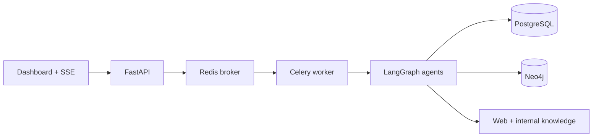

# Evidence-first Deep Research Platform

근거를 추적하고, 장시간 실행을 관찰하며, 결과 품질을 측정하는 멀티 에이전트 리서치 플랫폼입니다.

## 왜 만들었나

일반적인 LLM 리서치는 과정이 보이지 않고 출처 검증이 어렵다. 이 프로젝트는 Planner, Searcher, Compression, Graph mapper, Writer, Critic의 작업을 이벤트로 저장하고, 최종 보고서가 어떤 출처와 엔터티 관계에 기반하는지 확인할 수 있게 만든다.

## 아키텍처



| 구성 요소 | 역할 |
|---|---|
| FastAPI | 비동기 작업 API, SSE 이벤트, PDF/Markdown 내보내기 |
| LangGraph | Planner → Searcher → Compression → Graph mapper → Writer → Critic |
| Celery + Redis | 장시간 작업 큐와 재시도 |
| PostgreSQL | 보고서, 상태, 이벤트, 출처, 성능·품질 지표 |
| Neo4j | `Research → Source → Entity` 근거 그래프 |
| Ollama / OpenAI | 로컬·클라우드 LLM Provider 전환 |

## 실행

```powershell
Copy-Item .env.example .env
docker compose up --build -d
```

대시보드: `http://localhost:8000`  
API 문서: `http://localhost:8000/docs`  
Neo4j Browser: `http://localhost:7474/browser/`

기본 `.env`는 Ollama를 사용합니다.

```env
LLM_PROVIDER=ollama
OLLAMA_BASE_URL=http://host.docker.internal:11434
OLLAMA_MODEL=hoangquan456/qwen3-nothink:4b
```

OpenAI를 사용하려면 `LLM_PROVIDER=openai`와 `OPENAI_API_KEY`를 설정합니다. `APP_API_KEY`가 설정된 경우 대시보드의 선택 입력란에 해당 키를 넣습니다.

## 신뢰성과 운영성

- 출처 번호가 보존된 Context Compression
- Critic 기반 수정 루프와 인용 유효성/범위 점수
- SSE Agent timeline 및 단계별 소요 시간
- 실패 작업 재실행, 최대 2회 Celery 재시도
- PostgreSQL 영속 저장 및 Neo4j 근거 그래프
- 요청 ID 구조화 로그와 Docker healthcheck
- 로컬 Ollama로 API 비용 없이 데모 가능

## 검증

```powershell
.\scripts\test.ps1
```

또는 `docker compose --profile test run --rm test`를 실행합니다. GitHub Actions도 push/PR마다 같은 테스트를 실행합니다.

## 데모와 포트폴리오

- [프로젝트 보고서](PORTFOLIO_REPORT.md)
- [3분 데모 스크립트](docs/DEMO_SCRIPT.md)
- [성능 측정 가이드](docs/BENCHMARK.md)
- [제출 전 체크리스트](docs/PORTFOLIO_CHECKLIST.md)
