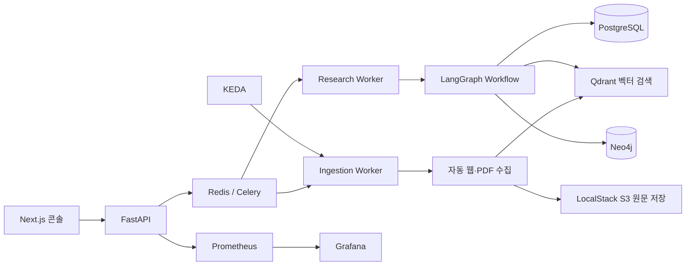

# ProofGraph

## 근거 중심 Workflow AI Research Platform

ProofGraph는 주제를 입력하면 계획 수립, 공개 근거 수집, RAG 검색, 보고서 작성, 인용 검증을 순서대로 수행하는 멀티 에이전트 리서치 플랫폼입니다. 단순한 LLM 호출이 아니라, 작업 상태·수집 원문·벡터 청크·근거 관계를 저장하고 운영 지표까지 관찰할 수 있도록 설계했습니다.

## 핵심 가치

- **Workflow 기반 AI**: LangGraph로 Planner → Searcher → Retriever → Compressor → Writer → Critic 흐름을 명시적으로 관리합니다.
- **근거 추적성**: 수집 문서는 LocalStack S3에 원문으로 보관하고, PostgreSQL·Qdrant·Neo4j에서 청크·출처·관계를 추적합니다.
- **대량 수집**: 전용 Celery Queue와 Worker로 주제 묶음을 비동기 처리합니다.
- **운영 가능성**: Kubernetes, KEDA, Prometheus, Grafana로 작업량과 시스템 상태를 관찰·확장합니다.



## 기술 구성

| 영역 | 기술 | 역할 |
|---|---|---|
| 웹 콘솔 | Next.js | 리서치 실행, 대량 수집, 결과·상태 확인 |
| API | FastAPI | 비동기 작업 요청, SSE, RAG·보고서 API |
| AI 워크플로 | LangGraph | 다단계 에이전트 상태 전이와 Critic 수정 루프 |
| 비동기 처리 | Celery + Redis | API 응답과 장시간 작업 분리, Queue 처리 |
| 관계 데이터 | PostgreSQL | 작업·이벤트·출처·품질·청크 메타데이터의 기준 저장소 |
| 벡터 검색 | Qdrant + pgvector | 검색 전용 벡터 인덱스, 백업·마이그레이션 보조 인덱스 |
| 지식 그래프 | Neo4j | Research·Source·Entity 관계 및 근거 경로 추적 |
| 원문 저장 | LocalStack S3 | 수집 원문·매니페스트·아티팩트 저장 |
| 확장 | Kubernetes(k3d) + KEDA | Redis 큐 길이에 따른 Worker 확장 |
| 관측성 | Prometheus + Grafana + Redis Exporter | 요청·지연·큐·작업·RAG 저장량 대시보드 |
| 로컬 모델 | Ollama + nomic-embed-text | LLM 응답·임베딩 비용을 로컬에서 통제 |

## 주요 기능

### 1. 멀티 에이전트 리서치

1. Planner가 주제를 목차와 검색 질문으로 분해합니다.
2. Searcher가 공개 웹·PDF 근거를 수집합니다.
3. Retriever가 Qdrant에서 기존 RAG 근거를 검색합니다.
4. Compressor가 Writer에 전달할 컨텍스트를 압축합니다.
5. Writer가 근거 기반 초안을 작성합니다.
6. Critic이 인용 범위·품질을 검증하고 필요하면 수정 루프를 실행합니다.

### 2. 대량 수집과 RAG 데이터 레이크

- UI에서 여러 주제를 한 번에 제출하면 `ingestion` 큐에서 비동기로 처리합니다.
- robots.txt, URL 정규화, 도메인별 요청 간격을 적용합니다.
- 원문과 매니페스트는 S3에 저장하고, 청크에는 `artifact_uri`를 기록합니다.
- URL별 콘텐츠 해시, ETag, Last-Modified, 버전을 저장해 불필요한 재임베딩을 줄입니다.
- 변경된 문서는 새 버전으로 저장하고 Qdrant 검색 인덱스에는 최신 버전을 반영합니다.

### 3. Kubernetes와 KEDA

- API 2개 Replica, 일반 Research Worker, 전용 Ingestion Worker를 분리합니다.
- Redis 큐를 KEDA가 감시하며 Worker를 자동 확장합니다.
- Ingestion Worker는 긴 작업 유실을 막기 위해 최소 1개를 유지하고 종료 유예 시간을 적용합니다.

### 4. 관측성

Prometheus 지표:

- API 요청 수·경로별 p95 응답 시간·오류 상태
- 리서치·대량 수집 작업 상태
- `celery`, `ingestion` 큐 적체
- 누적 RAG 청크 수
- Redis 메모리 사용량

Grafana에는 `ProofGraph 운영 대시보드`가 자동으로 생성됩니다.

## 빠른 실행: Docker Compose

### 사전 준비

- Docker Desktop
- Ollama

```powershell
ollama pull hoangquan456/qwen3-nothink:4b
ollama pull nomic-embed-text
Copy-Item .env.example .env
docker compose up -d --build
```

| 화면 | 주소 |
|---|---|
| Workflow 콘솔 | http://localhost:3000 |
| API 문서 | http://localhost:8000/docs |
| Neo4j Browser | http://localhost:7474/browser/ |
| Qdrant Dashboard | http://localhost:6333/dashboard |
| Prometheus | http://localhost:9090 |
| Grafana | http://localhost:3001 |

Grafana의 로컬 기본 계정은 `admin` / `admin`입니다. 실제 배포 환경에서는 Secret 또는 SSO로 반드시 교체해야 합니다.

## Kubernetes 실행

Kubernetes는 k3d, AWS API 모의 환경은 LocalStack으로 분리합니다.

```powershell
$token = Read-Host "LocalStack 인증 토큰" -AsSecureString
.\scripts\deploy-localstack-k8s.ps1 -LocalStackAuthToken $token

helm repo add kedacore https://kedacore.github.io/charts
helm repo update
helm install keda kedacore/keda --namespace keda --create-namespace
kubectl apply -k .\k8s\keda
kubectl apply -k .\k8s\observability
```

| Kubernetes 화면 | 주소 |
|---|---|
| Workflow 콘솔 | http://localhost:13000 |
| API | http://localhost:18000/docs |
| Grafana | `kubectl -n proofgraph port-forward svc/grafana 3001:3000` 후 http://localhost:3001 |

클러스터 중지·재시작:

```powershell
k3d cluster stop proofgraph
k3d cluster start proofgraph
```

## 검증

```powershell
docker compose --profile test run --rm test
```

현재 테스트는 API, Workflow 계약, RAG 청크 처리, S3 원문 보관, Qdrant 검색, 그래프 매핑, 품질 평가, Prometheus 지표를 검증합니다.

## 문서

- [Workflow AI 시스템 설계](docs/WORKFLOW_AI_SYSTEM.md)
- [대용량 수집·색인 설계](docs/LARGE_SCALE_DATA.md)
- [관측성 설계와 실행](docs/OBSERVABILITY.md)
- [LocalStack + Kubernetes 실행 가이드](docs/LOCALSTACK_KUBERNETES.md)
- [데모 스크립트](docs/DEMO_SCRIPT.md)
- [벤치마크 가이드](docs/BENCHMARK.md)
- [포트폴리오 체크리스트](docs/PORTFOLIO_CHECKLIST.md)

## 포트폴리오 어필 포인트

> ProofGraph는 LLM 기능을 단일 프롬프트가 아니라 상태 전이·근거 데이터·비동기 작업·운영 지표가 연결된 Workflow AI 시스템으로 구현했습니다. RAG와 그래프 근거를 결합하고, 대량 수집은 큐 기반으로 분리했으며, Kubernetes/KEDA와 Prometheus/Grafana로 운영 확장성과 관측성을 검증했습니다.
