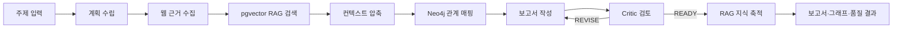
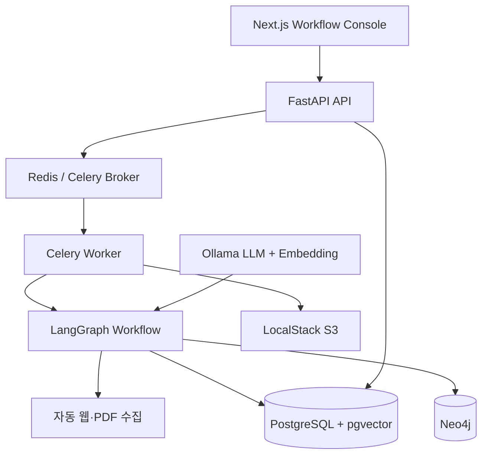

# ProofGraph

## 근거 중심 Workflow AI Platform

> **LLM을 단순 챗봇으로 호출하지 않고, 데이터 계약·실패 정책·품질 게이트를 갖춘 장기 실행형 AI 워크플로로 설계한 포트폴리오 프로젝트입니다.**

ProofGraph는 비즈니스 주제를 입력받아 웹 근거를 수집하고, pgvector RAG와 Neo4j 근거 그래프를 결합해 출처 기반 보고서를 만드는 Workflow AI 시스템입니다. 실행 과정과 근거는 PostgreSQL에 영속화되며, 다음 실행에서 재사용됩니다.

## 왜 만들었나

일반적인 LLM 리서치는 다음 문제가 있습니다.

- 결과가 만들어지는 중간 과정이 보이지 않는다.
- 출처가 약하거나 사실 검증이 어렵다.
- 이전 조사 결과가 다음 질문에 재사용되지 않는다.
- 긴 작업의 실패·재시도·상태 확인이 어렵다.

ProofGraph는 이를 **워크플로 분해, RAG 지식 축적, 근거 그래프, 비동기 작업 처리, 품질 검증**으로 해결합니다.

## 핵심 기능

| 기능 | 구현 내용 |
|---|---|
| Workflow AI Runtime | 단계별 책임·입출력 계약·실패 정책·품질 게이트를 가진 LangGraph 워크플로 |
| 자동 근거 수집 | 주제만 입력하면 검색 쿼리를 분화하고 공개 웹·PDF 근거를 수집 |
| RAG | 수집 자료를 청킹하고 Ollama 임베딩으로 변환해 PostgreSQL pgvector에 누적 |
| Graph RAG | Neo4j에 `Research → Source → Entity`와 엔티티 관계를 저장 |
| 비동기 실행 | FastAPI 요청, Celery Worker, Redis broker, PostgreSQL 상태 원본 분리 |
| 품질 검증 | Critic 수정 루프, 인용 유효성·출처 범위 기반 품질 점수 |
| 운영 관측성 | 실행 이벤트, 단계별 시간, 재시도 이력, SSE 진행 상태 |
| 결과 활용 | 출처·품질·근거 그래프 확인, Markdown/PDF 내보내기, LocalStack S3 아티팩트 저장 |

## 워크플로



워크플로 계약은 API로도 확인할 수 있습니다.

```text
GET /v1/workflows/evidence-first-research
```

## 아키텍처



| 계층 | 선택 기술 | 선택 이유 |
|---|---|---|
| 프런트엔드 | Next.js | 워크플로 실행·RAG 수집·벡터 검색·결과 검증 콘솔 |
| API | FastAPI | 비동기 작업 요청, SSE, 문서화된 REST API |
| 오케스트레이션 | LangGraph | 조건부 수정 루프를 가진 명시적 상태 머신 |
| 장기 작업 | Celery + Redis | API 응답과 긴 리서치 실행을 분리 |
| 상태 원본 | PostgreSQL | 작업·이벤트·출처·평가·보고서의 영속 저장 |
| 벡터 검색 | pgvector | 별도 벡터 DB 없이 PostgreSQL 트랜잭션과 결합 |
| 지식 그래프 | Neo4j | 출처·엔티티·관계의 근거 추적 |
| 로컬 모델 | Ollama | API 비용 없이 로컬 LLM·임베딩 실행 |
| 로컬 클라우드 | LocalStack | S3 등 AWS 의존성의 로컬 검증 |
| 배포 | Docker Compose / Kubernetes(k3d) | 로컬 개발과 Kubernetes 이관 경로 제공 |

## 빠른 실행

### 1. 사전 요구사항

- Docker Desktop
- Ollama

```powershell
# 로컬 모델 준비
ollama pull hoangquan456/qwen3-nothink:4b
ollama pull nomic-embed-text
```

### 2. 환경 파일 생성

```powershell
Copy-Item .env.example .env
```

기본값은 로컬 Ollama를 사용합니다. `APP_API_KEY`를 설정했다면 Next.js 화면의 API 키 입력란에 같은 값을 넣으세요.

### 3. 서비스 실행

```powershell
docker compose up -d --build
```

| 화면 | 주소 |
|---|---|
| Workflow AI Console | http://localhost:3000 |
| FastAPI 문서 | http://localhost:8000/docs |
| 기존 API 대시보드 | http://localhost:8000 |
| Neo4j Browser | http://localhost:7474/browser/ |

### 4. 사용 흐름

1. `http://localhost:3000`에서 **리서치 워크플로 실행**을 누릅니다.
2. 주제를 기준으로 Planner가 검색 계획을 만들고, 근거를 수집합니다.
3. 수집된 근거는 pgvector에 자동 누적됩니다.
4. 보고서가 끝나면 **출처 확인 → 품질 점수 확인 → 근거 그래프 확인** 순서로 검증합니다.
5. 검증한 결과를 Markdown 또는 PDF로 내보냅니다.

## RAG 자동 수집·검색

사용자가 URL을 직접 넣지 않아도 됩니다. 화면의 **RAG 자동 수집·색인**에서 주제만 입력하면 시스템이 다음을 수행합니다.

```text
주제 → 검색 쿼리 분화 → 공개 웹/PDF 본문 수집 → 청킹 → 임베딩 → pgvector 저장
```

수집된 지식은 이후 리서치의 `Retriever` 단계와 벡터 검색 화면에서 자동으로 재사용됩니다.

## 검증

```powershell
docker compose --profile test run --rm test
```

현재 테스트는 API, 품질 평가, 그래프 매핑, LLM Provider, RAG 청킹, 워크플로 계약을 검증합니다.

## Kubernetes + LocalStack

실제 Pod 실행은 k3d, AWS API 모의는 LocalStack으로 분리했습니다. LocalStack의 EKS API 모의만으로 Pod가 실행되는 것은 아니므로, 로컬 Kubernetes 실행 클러스터를 함께 사용합니다.

```powershell
$token = Read-Host "LocalStack 인증 토큰" -AsSecureString
.\scripts\deploy-localstack-k8s.ps1 -LocalStackAuthToken $token
```

자세한 내용은 [LocalStack + Kubernetes 실행 가이드](docs/LOCALSTACK_KUBERNETES.md)를 참고하세요.

## QLoRA 파인튜닝 파이프라인

검수된 보고서 예시를 기반으로 Writer 모델을 미세조정할 수 있는 QLoRA 파이프라인을 포함합니다.

> 실제 학습된 모델 가중치는 이 저장소에 포함하지 않습니다. 충분한 검수 데이터와 GPU 환경에서 기준 모델과 품질을 비교한 뒤 적용해야 합니다.

```powershell
python .\finetune\prepare_dataset.py --input .\reviewed-reports.json --output .\finetune\data\research_sft.jsonl
docker compose --profile finetune run --rm --gpus all finetune python train_qlora.py --dataset data/research_sft.jsonl
```

## 포트폴리오 핵심 어필 포인트

### 시스템 설계

- LLM 호출을 단일 프롬프트가 아닌 **경계가 있는 워크플로 단계**로 분리했습니다.
- 각 단계에 데이터 계약, 실패 정책, 관측 이벤트, 영속 상태 전이를 두었습니다.
- Redis를 상태 저장소가 아닌 Celery broker로 한정하고, PostgreSQL을 작업 상태의 원본으로 사용했습니다.

### AI 신뢰성

- 웹 근거·RAG·그래프 관계를 결합해 근거 없는 생성 범위를 줄였습니다.
- Writer 전에 Context Compression 경계를 두어 긴 컨텍스트를 통제했습니다.
- Critic 단계와 인용 품질 점수로 결과 검증 경로를 만들었습니다.

### 운영·확장성

- API와 Worker를 분리해 장기 작업이 웹 요청을 막지 않게 했습니다.
- 실행 이력, 단계별 시간, 재시도, 결과 내보내기를 제공했습니다.
- Docker Compose에서 Kubernetes로 이관할 수 있는 매니페스트·스크립트를 만들었습니다.

## 면접 30초 소개

> “ProofGraph는 단순 챗봇이 아니라 근거 기반 결과를 만들고, 그 근거를 다음 실행에 재사용하는 Workflow AI 시스템입니다. LLM 단계를 데이터 계약과 실패 정책을 가진 LangGraph 워크플로로 분리했고, pgvector RAG·Neo4j·비동기 작업 큐를 결합해 AI 기능과 서비스 운영 관점을 함께 구현했습니다.”

## 문서

- [Workflow AI 시스템 설계](docs/WORKFLOW_AI_SYSTEM.md)
- [LocalStack + Kubernetes 실행 가이드](docs/LOCALSTACK_KUBERNETES.md)
- [3분 데모 스크립트](docs/DEMO_SCRIPT.md)
- [성능 측정 가이드](docs/BENCHMARK.md)
- [포트폴리오 체크리스트](docs/PORTFOLIO_CHECKLIST.md)
- [프로젝트 보고서](PORTFOLIO_REPORT.md)
